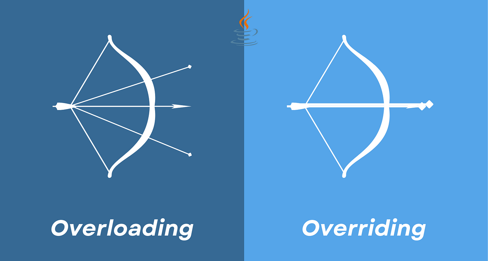
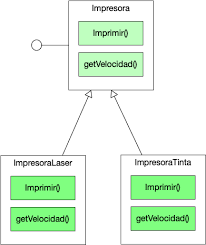

## OVERLOAD
La sobrecarga, u overload, implica la creación de nuevos métodos con diferentes asignaturas

## OVERRIDE
La sobreescritura es ocultar un método por otro que lo reemplaza

## INTERFACE
Es una plantilla donde se definen un conjunto de métodos que deben de implementarse en las clases que la heredan

