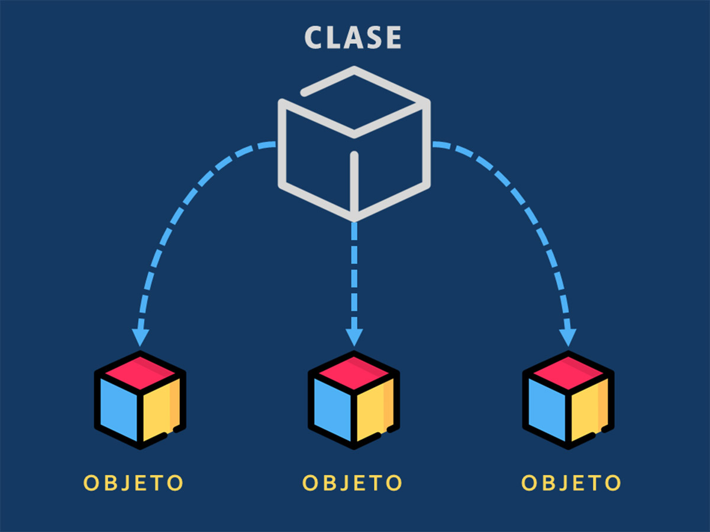
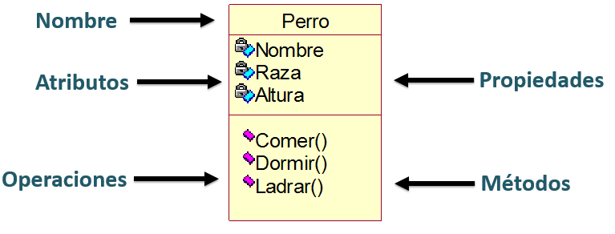

# Programación Orientado a Objetos
Lenguaje Java, IDE NetBeans

## Concepto
Es un enfoque que se basa en la creación y manipulación de objetos, que combinan datos y comportamientos.

## OBJETO
Es una entidad que contiene información (atributos) y acciones (métodos)

## ATRIBUTOS
Son las características del objeto

## MÉTODOS
Son las acciones que puede realizar el objeto

## CLASE
Las clases son plantillas de objetos que definen las características y comportamientos de un mismo tipo.

