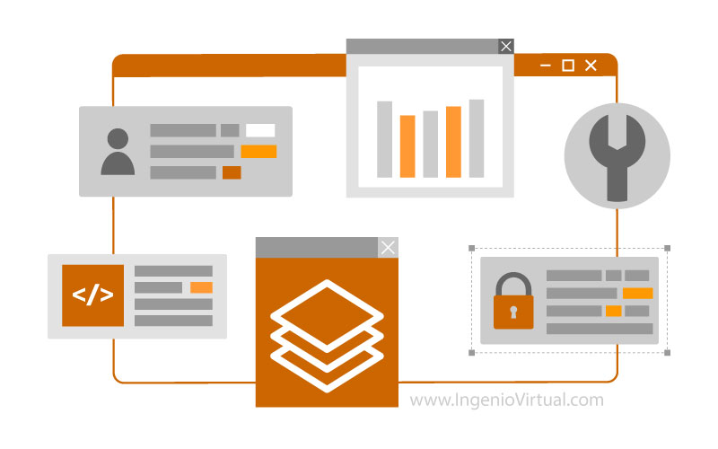
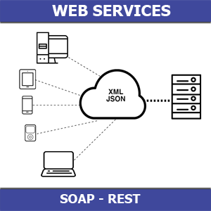
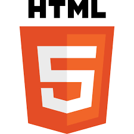
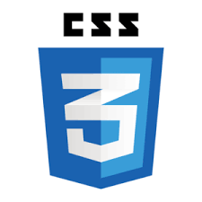
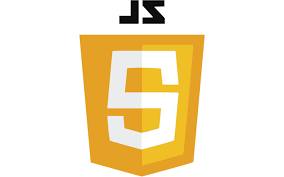

# Introducción al Desarrollo Web

> Full teoría, <i>revisar el final para la explicación de las etiquetas en HTML</i>

> **⚠️ IMPORTANTE** visitar la página de w3school, link: https://www.w3schools.com/

## 1. ¿Qué es el desarrollo web?
El desarrollo web es el proceso de crear y mantener sitios y aplicaciones que funcionan a través de internet. Abarca tanto la parte visual con la que interactúa el usuario (frontend) como la lógica del servidor y bases de datos (backend). Su finalidad es permitir experiencias funcionales, dinámicas y accesibles desde un navegador.

---
## 2. Aplicación web
Una aplicación web es un programa que se ejecuta en un navegador y permite al usuario realizar tareas complejas como compras, gestión de información o comunicación. A diferencia de una simple página informativa, una aplicación web permite interacciones dinámicas y suele depender de bases de datos y servicios web. Ejemplos comunes son plataformas como Gmail, Facebook o un sistema de ventas online.

---
## 3. Servicio web
Un servicio web es una herramienta que permite el intercambio de datos entre sistemas a través de internet, usualmente mediante protocolos como HTTP y formatos como JSON o XML. Sirve para que una aplicación web pueda comunicarse con otros sistemas, como acceder a una base de datos externa o consultar una API de clima. Los servicios web no tienen interfaz visual, pero son esenciales para el funcionamiento dinámico de las aplicaciones.

---
## 4. Página web
Una página web es una unidad de contenido accesible desde un navegador, construida principalmente con HTML. Puede ser parte de una aplicación web o un sitio informativo. Las páginas pueden ser estáticas, mostrando contenido fijo, o dinámicas, cambiando según los datos o la interacción del usuario.

---
## 5. HTML (estructura)
HTML, o HyperText Markup Language, es el lenguaje que define la estructura básica de una página web. Con etiquetas específicas, se indican elementos como títulos, párrafos, tablas, imágenes y formularios. HTML organiza el contenido, pero no lo estiliza ni lo hace interactivo.

---
## 6. CSS (estilo)
CSS, o Cascading Style Sheets, es el lenguaje que se usa para aplicar estilos visuales al contenido estructurado con HTML. Permite definir colores, fuentes, tamaños, posiciones, márgenes y diseños generales. Gracias a CSS, las páginas web son atractivas y adaptables a distintos dispositivos.

---
## 7. JavaScript (comportamiento)
JavaScript es un lenguaje de programación que permite agregar dinamismo e interactividad a las páginas web. Con él se pueden realizar validaciones, responder a eventos como clics, cargar contenido sin recargar la página (AJAX), y manipular el DOM para actualizar la interfaz en tiempo real. Es esencial para el funcionamiento moderno de aplicaciones web.

---
---
### Etiquetas HTML
- **html**: Es la etiqueta raíz que envuelve todo el contenido HTML de la página.

- **head**: Contiene información no visible para el usuario, como el título de la página, enlaces a estilos (CSS) o scripts.

- **title**: Define el título que aparece en la pestaña del navegador.

- **body**: Contiene todo el contenido visible de la página (textos, imágenes, botones, etc.).

- **h1** a **h6**: Son encabezados, donde h1 es el más importante (título principal) y h6 el menos importante.

- **p**: Define un párrafo de texto.

- **a**: Crea un enlace a otra página o sitio (href es el atributo para indicar la dirección).

- **img**: Inserta una imagen (src indica la ruta de la imagen y alt una descripción).

- **div**: Contenedor genérico para agrupar otros elementos (muy usado en diseño).

- **span**: Contenedor en línea para aplicar estilos a parte de un texto.

- **ul**, **ol**, **li**: Sirven para listas. ul es una lista sin orden, ol es ordenada, y li define cada ítem.

- **form**: Crea un formulario para enviar datos.

- **input**, **label**, **textarea**, **button**: Se usan dentro del formulario para entradas de texto, etiquetas, áreas de texto y botones.