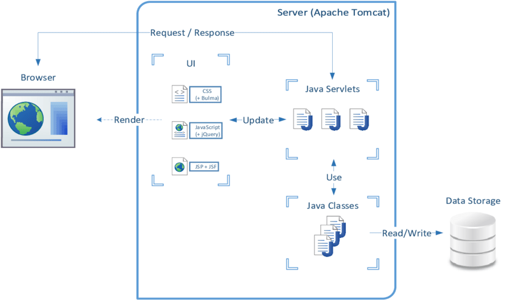

>Para la creación de aplicaciones web, se utiliza un servidor (**Tom Cat**), un programa que gestione solicitudes HTTP (**Servlet**) y una plantilla que se ejecute en el programa (**JavaServer Page**).

---
# ¿Qué es Apache Tom Cat?
Apache Tom Cat es un servidor de aplicaciones Java de código abierto que sirve como contenedor de servlets.

---
# ¿Qué es un Servlet?
Un servlet es un programa Java que se ejecuta en un servidor web y gestiona solicitudes HTTP.

---
# ¿Qué es un JSP?
Conocido por sus siglas JSP, JavaServer Pages es una tecnología basada en Java que permite a los desarrolladores crear contenido web dinámico. Los ficheros JSP combinan HTML con código Java, esto permite generar páginas web que pueden cambiar su contenido de acuerdo a la lógica del servidor.

---

---
instalación de Apache TomCat: https://www.youtube.com/watch?v=mk4wpq7pFv0

hacer un CRUD en java con mysqli: https://www.youtube.com/watch?v=8OuN_e2suBA&t=4777s