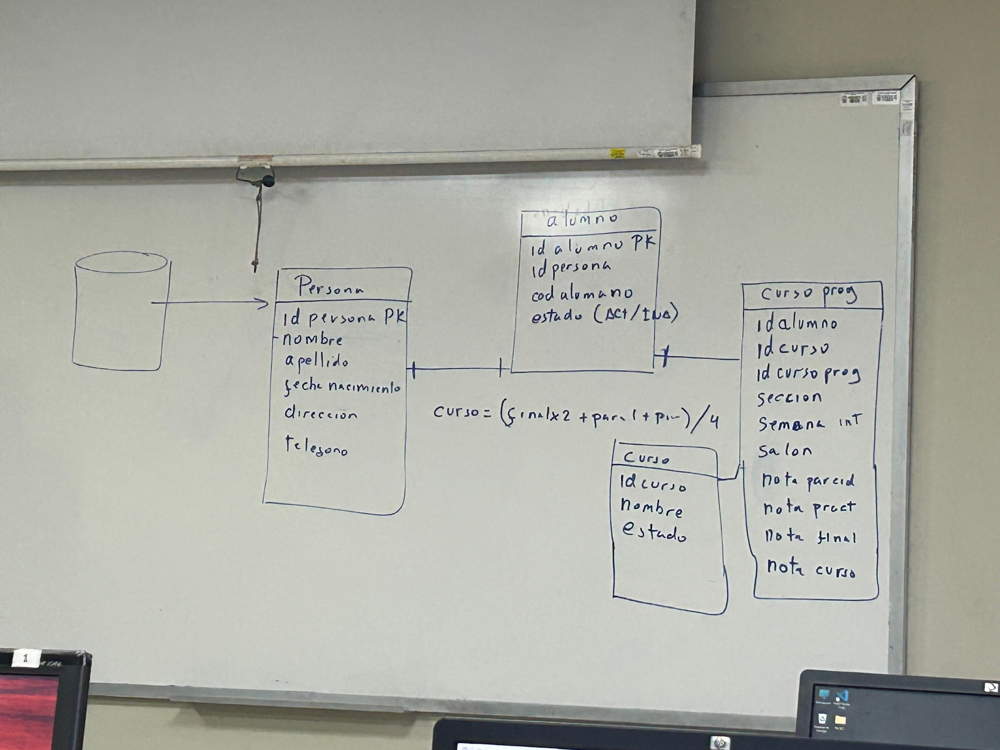
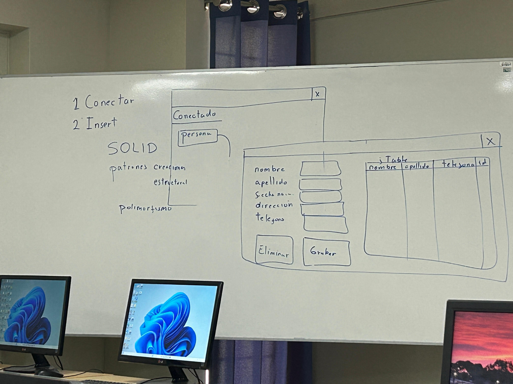
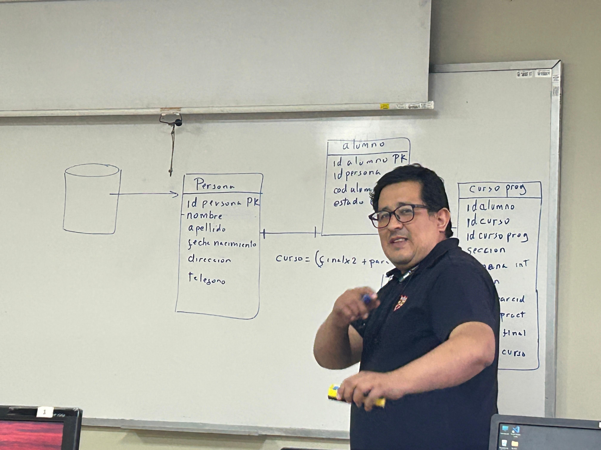

# Sistema CRUD de Personas
Desarrollar una aplicación en Java que permita registrar personas y gestionar su información de manera sencilla. El sistema debe contar con una interfaz donde se puedan ingresar, visualizar, modificar y eliminar datos de personas (operaciones CRUD), y estos datos deben guardarse tanto en una tabla dentro de la aplicación como en una base de datos para asegurar que no se pierdan.

La idea es tener un sistema básico pero funcional, que permita mantener un registro ordenado de las personas y poder hacer cambios en cualquier momento. Esta aplicación servirá como base para entender cómo conectar una interfaz gráfica con una base de datos usando Java, y cómo manejar los datos de forma eficiente.

---
## Imágenes de la clase

Comenzar con la tabla de Personas para la base de datos, se tiene como objetivo tenerlo como base para la PC4 e implementar las demás tablas.

---

Mostrar en el JFrame que se logró la conexión con la base de datos, debe de haber un botón para poder abrir otro JFrame para poder registrar, actualizar, eliminar personas.
> [!IMPORTANT] En la tabla se deben de mostrar los datos de las personas en todo momento, ya sea al registrar, actualizar, o eliminar. La tabla debe de reflejar la base de datos de las personas.

---
Se debe de implementar los principios SOLID y patrones de diseño

SUERTE CHICOS, by profe

