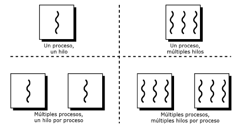
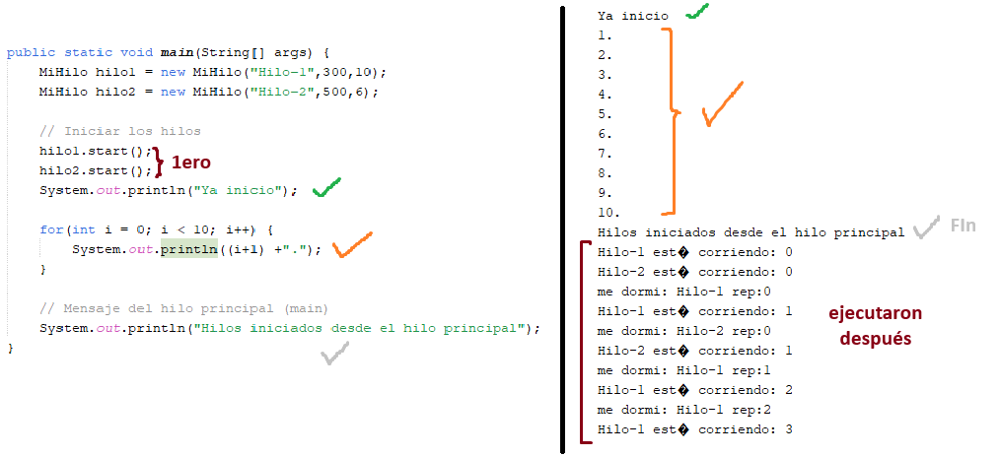

# ¿Qué es un hilo?
Un hilo es una secuencia de instrucciones las cuales se programan para su ejecucion.

Hilo -> Proceso (conjunto de hilos)

A diferencia de los procesos, que son instancias de un programa, entidades independientes y no comparten información entre ellos, un thread (hilo) es la unidad más pequeña a la cual un procesador puede asignar tiempo, con secuencias más pequeñas de instrucciones a ejecutar.

Se crean, ejecutan y mueren dentro de los procesos, y comparten información entre ellos.

### PROCESOS E HILOS

### HILOS

~Se ejecuta al mismo tiempo que el programa (síncrono)

## TAREA
Elaborar un programa en Java, donde se ingrese un número (límite), y un hilo calcule la suma de todos los números pares, otro calcule la suma de todos los números impares, y el último calcule la suma de todos los números primos, hasta el número y que se muestren en consola los resultados al mismo tiempo.