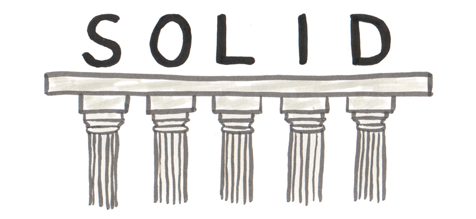
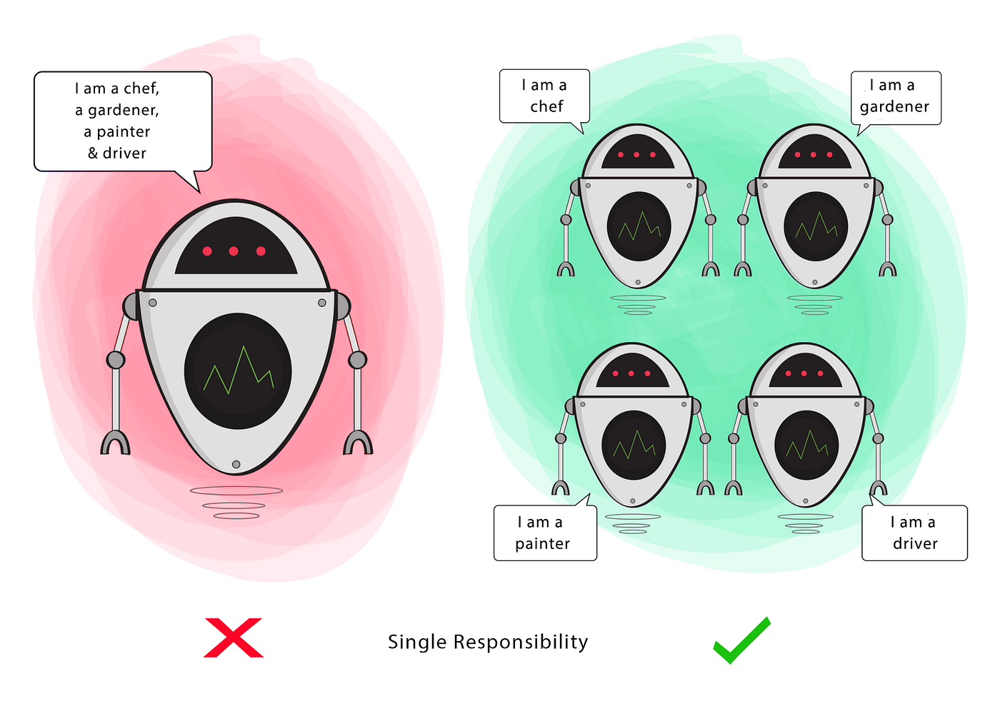
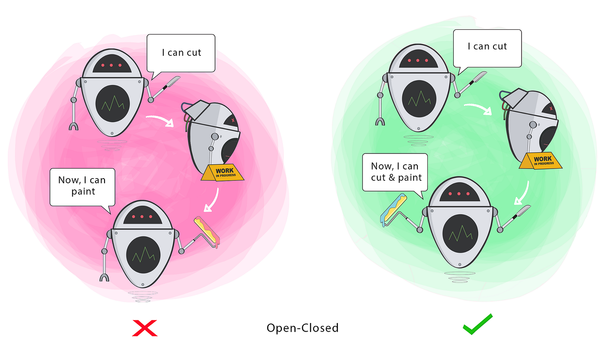
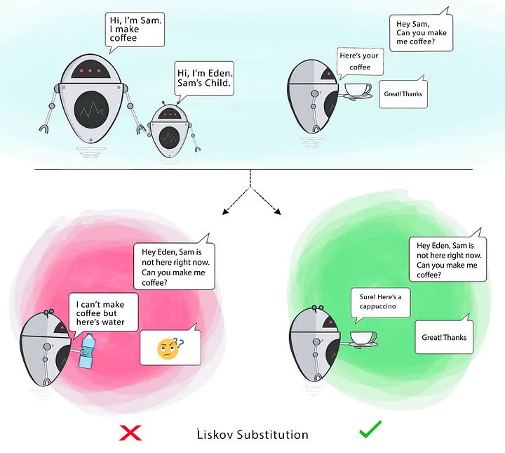
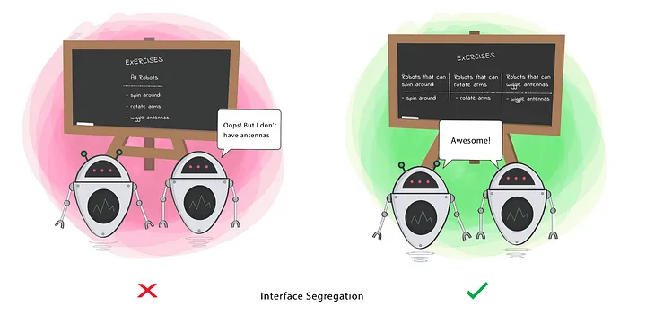
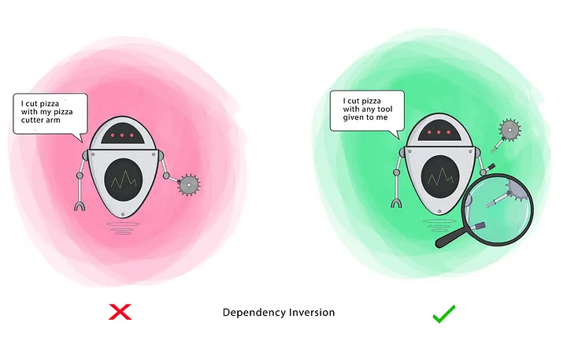

# Principios SOLID
Los Principios SOLID tienen cinco principios de diseño de clases Orientado a Objetos. Son un conjunto de reglas y mejores prácticas a seguir al diseñar una estructura de clase.

---
## 1. Principio de Responsabilidad Única (Single Responsability Principle)
Establece que una clase o módulo en el software debe tener una sola razón para cambiar.

Cada componente del sistema debe desempeñar una única responsabilidad o tarea específica.

---
## 2. Principio de Apertura y Cierre (Open/Closed Principle)
El principio de apertura y cierre exige que las clases deban estar abiertas a la extensión y cerradas a la modificación.

Modificación significa cambiar el código de una clase existente y extensión significa agregar una nueva funcionalidad.

Entonces, lo que este principio quiere decir es: Deberíamos poder agregar nuevas funciones sin tocar el código existente para la clase.

---
## 3. Principio de Sustitución de Liskov (Liskov Substitution Principle)
Se refiere a la idea de que las subclases deben ser intercambiables con sus clases base sin afectar la correctitud del programa. En otras palabras, si una clase A es una subclase de B, entonces podemos utilizar un objeto de la clase B donde se espera un objeto de la clase A sin causar problemas.

---
## 4. Principio de Segregación de Interfaces (Interface Segregation Principle)
El ISP se enfoca en la creación de interfaces específicas para los clientes, en lugar de una única interfaz grande que contenga métodos no utilizados por todos los clientes.

Esto evita que las clases implementen métodos innecesarios y, en su lugar, define interfaces más pequeñas y cohesivas que se ajusten a las necesidades de cada cliente.

---
## 5. Principio de Inversión de Dependencia (Dependency Inversion Principle)
El principio de inversión de dependencia establece que nuestras clases deben depender de interfaces o clases abstractas en lugar de clases y funciones concretas.

