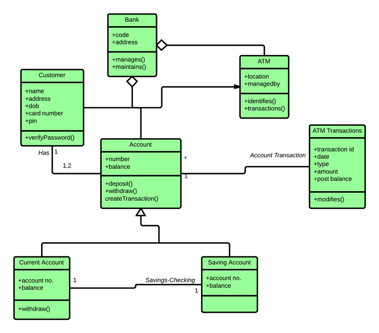

## ETAPA 1 (Parte Cliente)

Elaborar un formulario con los siguientes datos:

- Nombres (txtfield)
- Tipo de documento: DIN o RUC (combobox)
- Documento: validación, cnt. dígitos y que concuerde con el combobox (txtfield)
- Tipo de Comprobante de Pago: Boleta o Factura (combobox)
- Código de comprobante: Se genera cuando selecciones boleta o factura (txtfield)
- Fecha (txtfield)

Guardarlo todo en un objeto (Crear clases)

## ETAPA 2 (Parte Sistema)

Elaborar un JFrame que registre en una tabla los productos ingresados en pantalla, los productos tienen las siguientes características:

- Código del producto (txtfield)
- Nombre del producto (txtfield)
- Precio Unitario: precio de la unidad sin el impuesto (txt field)
- Cantidad de productos (txtfield)
- Descuento: aplica o no aplica para el producto y cuánto si es que sí (txtfield)

Elaborar un botón que con un evento click, guarde los datos de cada producto en cada fila de una JTable

## ETAPA 3 (Código)

Elaborar la interfaz Producto, y las clases ProductoConDescuento, ProductoSinDescuento, Comprobante

En la interfaz Producto, declarar los métodos setPrecio, getPrecio, getDescripcion, posteriormente se implementan en ProductoConDescuento y ProductoNormal (uso de Override para los métodos), y adaptar tus clases a lo que se va generando en el proyecto (Sistema de Ventas), añadir atributos y metodos a conveniencia, con sus respectivos get y set.

La clase Comprobante contiene una lista de productos, y calcule el total de compra.

USO DE POLIMORFISMO PARA EL MANEJO DE PRODUCTONORMAL Y PRODUCTOCONDESCUENTO ! !

## ETAPA 4 (UML)

Diseñar el diagrama de clases del proyecto total, utilizar herramientas como LucidChart (Online) o el software StartUML, ejm:

## ETAPA 5 (Exposición) 

Presentación del diagrama de clases.
Presentación de la ejecución del programa.
Presentación del uso de los conocimientos adquiridos en clase (Interface, Clases, Herencia, Abstract, Polimorfismo)

NO EXPLICAR CÓDIGO DEL JFRAME!